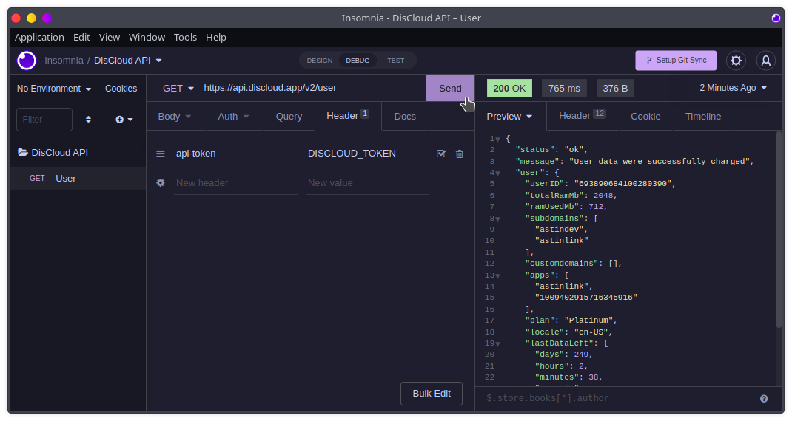
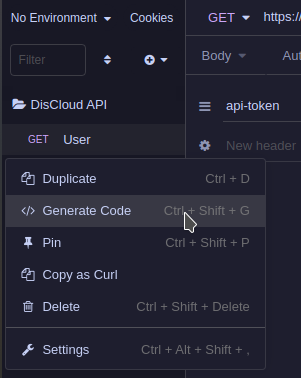
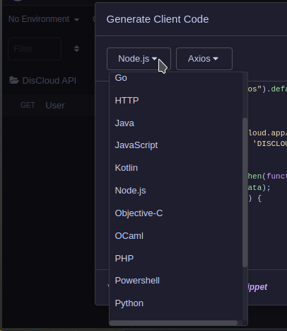
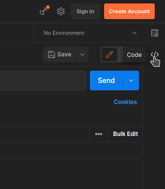
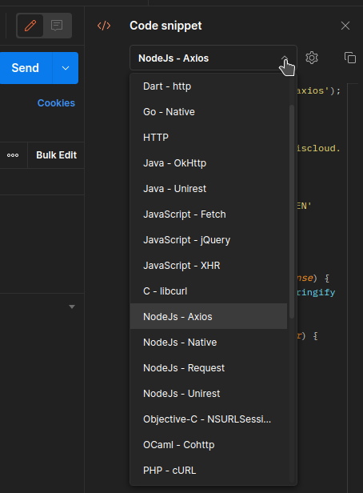

# 📡 Usar a API

## :pencil: Requisitos

#### Obter o token

Para obter o seu token use o comando [api](../suporte/comandos/api.md).

## Começar

<figure><figcaption></figcaption></figure>

### Comece a usar a API


```shell
curl --request GET \
  --url https://api.discloud.app/v2/user \
  --header 'api-token: DISCLOUD_TOKEN'
```



Renomeie `DISCLOUD_TOKEN` com o seu token


Você pode importar o código a cima em aplicativos como o [Insomnia](https://insomnia.rest/download) ou [Postman](https://www.postman.com/downloads/), e a partir deles testar e gerar códigos para a linguagem que desejar

> Exemplos:



<div>

<figure><figcaption><p>1</p></figcaption></figure>

 

<figure><figcaption><p>2</p></figcaption></figure>

</div>





<div>

<figure><figcaption><p>1</p></figcaption></figure>

 

<figure><figcaption><p>2</p></figcaption></figure>

</div>


