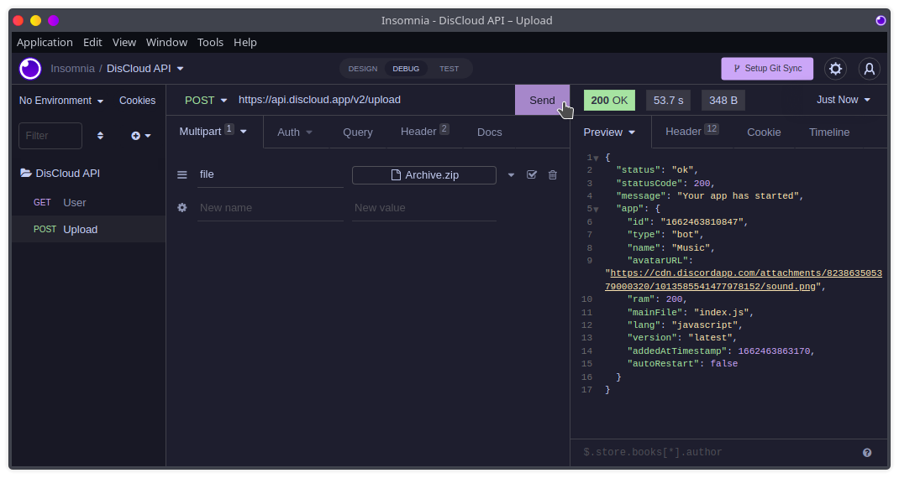

# 📡 Usar a API

## :pencil: Requisitos

#### Obter o token

Para obter o seu token use o comando [api](../suporte/comandos/api.md).

## Começar

<figure><figcaption></figcaption></figure>

### Comece a usar a API


```shell
curl --request GET \
  --url https://api.discloud.app/v2/user \
  --header 'api-token: DISCLOUD_TOKEN'
```



Renomeie `DISCLOUD_TOKEN` com o seu token


Você pode importar o código a cima em aplicativos como o [Insomnia](https://insomnia.rest/download) ou [Postman](https://www.postman.com/downloads/), e a partir deles testar e gerar códigos para a linguagem que desejar

> Exemplos:



<div>

<figure><figcaption><p>1</p></figcaption></figure>

 

<figure><figcaption><p>2</p></figcaption></figure>

</div>





<div>

<figure><figcaption><p>1</p></figcaption></figure>

 

<figure><figcaption><p>2</p></figcaption></figure>

</div>



## Fazer o upload de um projeto com a API

<figure><figcaption></figcaption></figure>

### :pencil:Requisitos

* O seu arquivo .zip deve incluir o [discloud.config](../suporte/faq/discloud.config.md)
* O seu arquivo .zip deve ter um tamanho `<=100MB`


```shell
curl --request POST \
  --url https://api.discloud.app/v2/upload \
  --header 'Content-Type: multipart/form-data' \
  --header 'api-token: DISCLOUD_TOKEN' \
  --header 'content-type: multipart/form-data; boundary=---011000010111000001101001' \
  --form file=@/home/diogo/Documents/bot/Archive.zip
```

