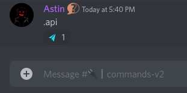
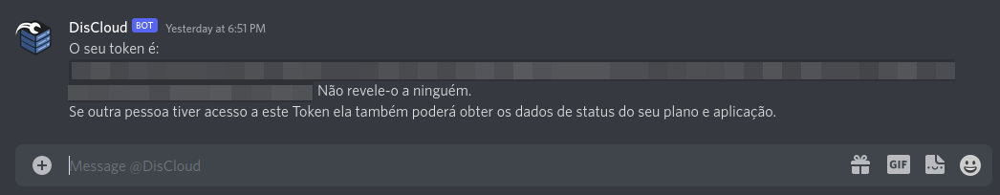

# api

**Gera um token para o uso da API da DisCloud.**

## **Como Usar?**

<figure><figcaption></figcaption></figure>

#### O seu token será enviado para a sua DM.

<figure><figcaption></figcaption></figure>

### Como resetar o meu token?

Digite novamente o comando e obtenha o seu novo token, os tokens criados anteriormente ficaram **inválidos e não poderão ser usados**.


**Não revele o token para ninguém**, se isso acontecer você deve resetar o mais rápido possivel.

**Nota:** Qualquer pessoa com o seu token tem acesso total à sua conta da DisCloud.

