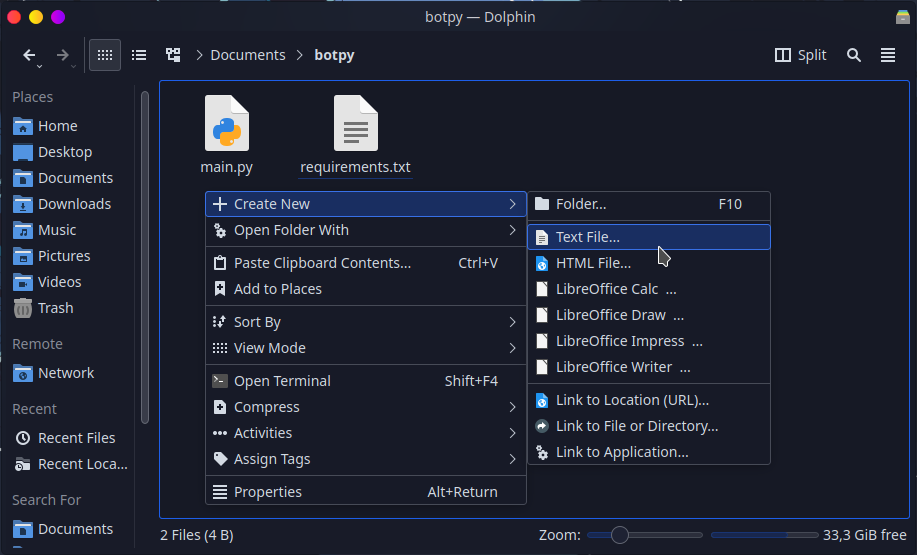
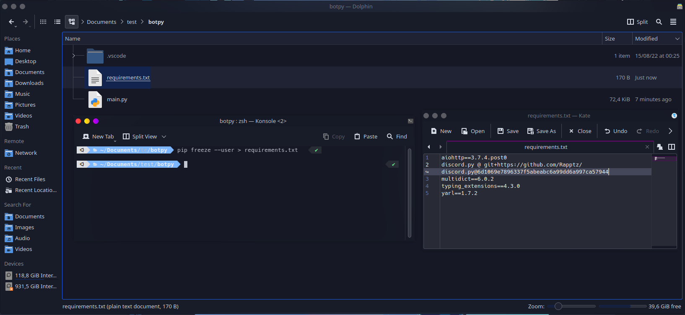

# 📄 Criar o requirements.txt

É um **simples arquivo de texto** que salva uma lista de **pacotes** necessários pelo seu projeto.&#x20;

## Como criar o arquivo `requirements.txt`?

Comece por entrar no diretório do seu projeto e criar um novo arquivo **txt** e certifique-se de que seja **nomeado para** `requirements.txt`



### Colocando pacotes no seu `requirements.txt`


As bibliotecas não são as que você **importa** no seu código, e sim as que você instala pelo **pip install**.


### discord.py (PyPI) (Estável)

Adicione a seguinte linha no seu `requirements.txt`


```
discord.py
```


Quando não especificamos uma versão, o **pip** sempre tentará instalar a versão mais recente do pacote especificado. Podemos especificar versões das seguintes maneiras:

> * `discord.py==2.0.0` - Define uma versão específica a ser instalada. Fixar a versão dessa forma garante que o seu projeto vai sempre estar funcionando, caso o seu codigo ainda não esteja adaptado para uma versão superior
> * `discord.py>=2.0.0`: Quando usamos o sinal de **`>=`** estamos dizendo que queremos instalar qualquer versão superior ou igual da biblioteca.

### discord.py (git) (Instável)

Adicione a seguinte linha no seu `requirements.txt`


```python
git+https://github.com/Rapptz/discord.py
```


Dessa forma conseguimos instalar pacotes **Python** que estejam disponíveis no **GitHub** mas não no **PyPI**, como versões ainda em desenvolvimento.

### Adicionar pacotes automaticamente

Se você tiver o **Python** instalado no seu computador pode executar um simples comando no seu Terminal para colocar todas as **bibliotecas** e as **suas versões** em um `requirements.txt`


`Certifique-se de ter todos os pacotes necessários pelo seu projeto instalados no seu computador antes de executar`


Abra o Terminal no diretório do seu projeto (Windows use: **Shift+Botão Direito** e clique em **Open PowerShell**) e digite:

```
pip freeze --user > requirements.txt
```

> **--user** - Apenas a saída de pacotes instaladas pelo usuário




Você precisa do **python e pip** instalado no seu computador, caso não esteja instalado siga as instruções abaixo.


### Instale o `Python` no seu computador

> **pip** - Instalador de pacotes oficial para Python.

> Selecione o seu Sistema Operacional



### Instalando o `Python`

### [Baixe o Python Aqui](https://www.python.org/downloads/)


### Verifique a instalação do `Python`

Abra o **cmd** ou **PowerShell** e digite**:**

```
python --version
```

### Verifique a instalação do `pip`

Abra o **cmd** ou **PowerShell** e digite**:**

```
pip -V
```


Se retornar a versão de ambos então está instalado corretamente!




### Instalando o `Python`

###  Ubuntu

Se você usa **Ubuntu** ou alguma distro baseada, digite o seguinte comando no Terminal:

```
sudo apt install python3 python3-pip
```

Informações dos pacotes dos Repositórios: [python](https://packages.ubuntu.com/search?suite=all\&section=all\&arch=any\&keywords=python3\&searchon=names), [pip](https://packages.ubuntu.com/search?suite=all\&section=all\&arch=any\&keywords=python3-pip\&searchon=names)

###  Fedora

Se você utiliza **Fedora** digite o seguinte comando no Terminal

```
sudo dnf install python3 python3-pip
```

Informações dos pacotes dos Repositórios: [python](https://packages.fedoraproject.org/pkgs/python3.10/python3/), [pip](https://packages.fedoraproject.org/pkgs/python-pip/python3-pip/)

###  Arch Linux

Se você utiliza **Arch Linux** ou alguma distro baseada, digite o seguinte comando no Terminal:

```
sudo pacman -S python python-pip
```

Informações dos pacotes dos Repositórios: [python](https://archlinux.org/packages/core/x86\_64/python/), [pip](https://archlinux.org/packages/extra/any/python-pip/)

### Verifique a instalação do `Python`

Abra o **Terminal** e digite:

```
python --version
```

### Verifique a instalação do `Pip`

Abra o **Terminal** e digite:

```
pip -V
```


Se retornar a versão de ambos então está instalado corretamente!



